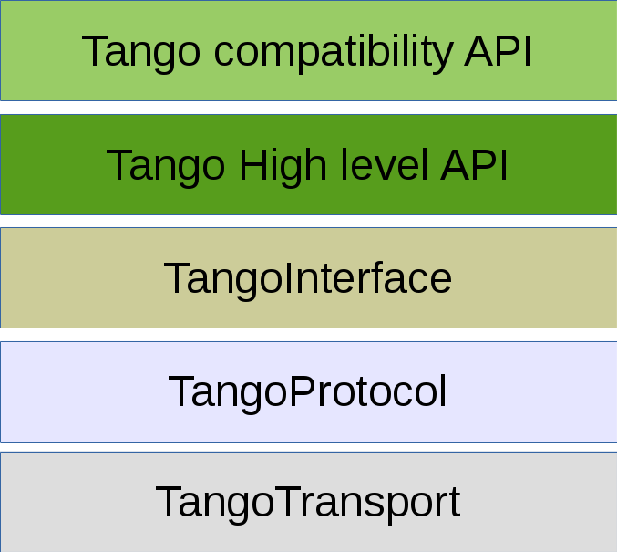

# Layered architecture



1. Transport layer:

Skeletal implementation resides in org.tango.v10.transport package

Layer remarks:
- low level basic layer

Implementation remarks:
- transparent reconnection

2. Protocol layer:

Skeletal implementation resides in org.tango.v10.protocol package


Implementation remarks:
- validates Request/Response and throws TangoProtocolException if validations fails
- How it is in EPICs https://epics.anl.gov/docs/APS2014/05-CA-Concepts.pdf


3. TangoInterfaceLayer

Skeletal implementation resides in org.tango.v10.service package  (interface can not be used as package name)

```java

//etc

//utility interfaces/mixins
interface Subscriable {
  void subscribe(Callback);
}

interface Configuration {
  //anotation based implementations
}

interface Configurable {
  void setConfiguration(Configuration);
}

interface ChangeEvent extends Configurable, Subscriable{
  
}

interface PeriodicEvent extends Configurable, Subscriable{
  
}

interface ArchiveEvent extends Configurable, Subscriable{
  
}
```

Layer remarks:
- adds Tango interface semantics to TangoProtocol layer by introducing high level abstractions (Host, Device etc)
- TangoTarget is an interface from lower layer


4. TangoLogicLayer (Client)

General purpose client library. Introduces even more high level API: AdminDevice; DataBase etc

Skeletal implementation resides in org.tango.v10.client package

5. TangoLogicLayer (Server)

Skeletal implementation resides in org.tango.v10.server package

6. Tango API layer (client/server)

Skeletal implementation resides in org.tango.v10.api.client/server package

7. TangoCompatibility layer

Bridge to previous Tango version

# General remarks

## Separation data production from data consuming
 
Event bus separates modules that produce data from modules that consumes data. This is required by modifiability qa.

## Concurrency

The system designed to run in multithreaded environment
