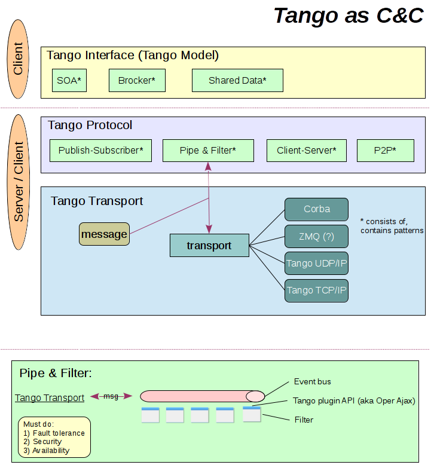
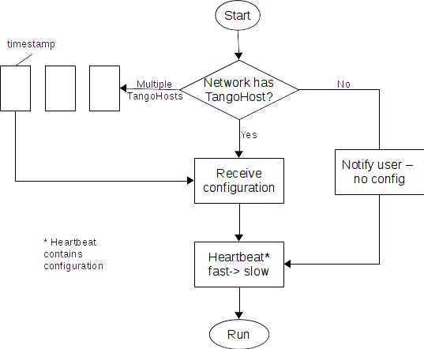
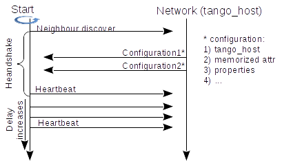

# Layered architecture

Below are the layers that should be designed and implemented in **Tango core library**:


---


Design sketch of Tango component and connectors separated by layers:



---


**1 Tango Transport layer**

Skeletal implementation resides in [org.tango.v10.transport](#src/main/java/org/tango/v10/transport) package

Tango Transport layer remarks:

- low level basic transport layer

Tango Transport layer implementation remarks:

- transparent reconnection;
- session auto-close;
- message delivery guarantee.

**2 Tango Protocol layer**

Skeletal implementation resides in org.tango.v10.protocol package

We propose to design Tango protocol using block schemes as below and translate them in an API. If needed sequence diagrams can be used.

Block scheme where server recieves configuration form Tango Host:



Sequence diagram where server recieves configuration form Tango Host:



Tango Protocol layer implementation remarks:

- Tango Protocol layer validates Request/Response and throws TangoProtocolException if validations fails
- How it is done in EPICs https://epics.anl.gov/docs/APS2014/05-CA-Concepts.pdf


**3 Tango Interface layer**

Skeletal implementation resides in org.tango.v10.service package  ("service" word is used as "interface" can not be used as package name)

```java

//etc

//utility interfaces/mixins
interface Subscriable {
  void subscribe(Callback);
}

interface Configuration {
  //anotation based implementations
}

interface Configurable {
  void setConfiguration(Configuration);
}

interface ChangeEvent extends Configurable, Subscriable{
  
}

interface PeriodicEvent extends Configurable, Subscriable{
  
}

interface ArchiveEvent extends Configurable, Subscriable{
  
}
```

Tango Interface layer remarks:

- adds Tango interface semantics to Tango Protocol layer by introducing high level abstractions (Host, Device etc);
- TangoTarget is an interface from lower layer


**4 Tango API layer (client/server)**

General purpose client library. Introduces even more high level API: AdminDevice; DataBase etc

Skeletal implementation resides in org.tango.v10.client package

Skeletal implementation resides in org.tango.v10.server package

Skeletal implementation resides in org.tango.v10.api.client/server package


**5 Tango Compatibility layer**

Bridge to previous Tango versions.


# General remarks of a new Tango core library

## Separation data production from data consuming
 
Event bus separates modules that produce data from modules that consume data. This is required by modifiability quality attribute.

## Concurrency

The system should be designed to run in multithreaded environment.
