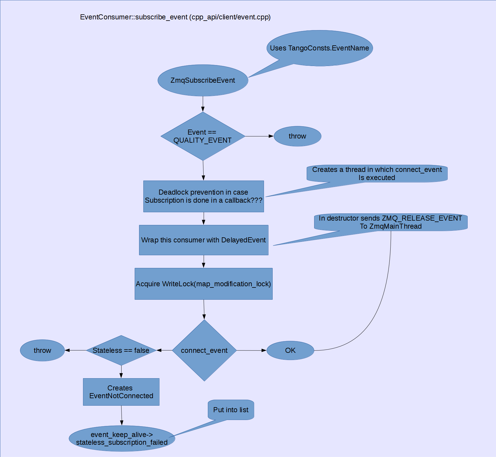
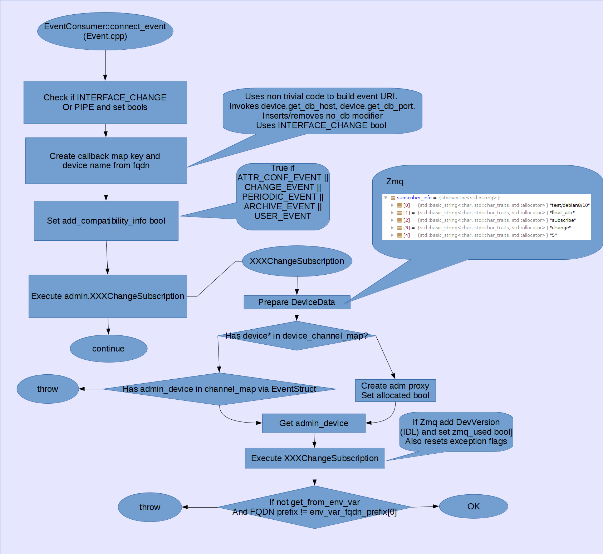
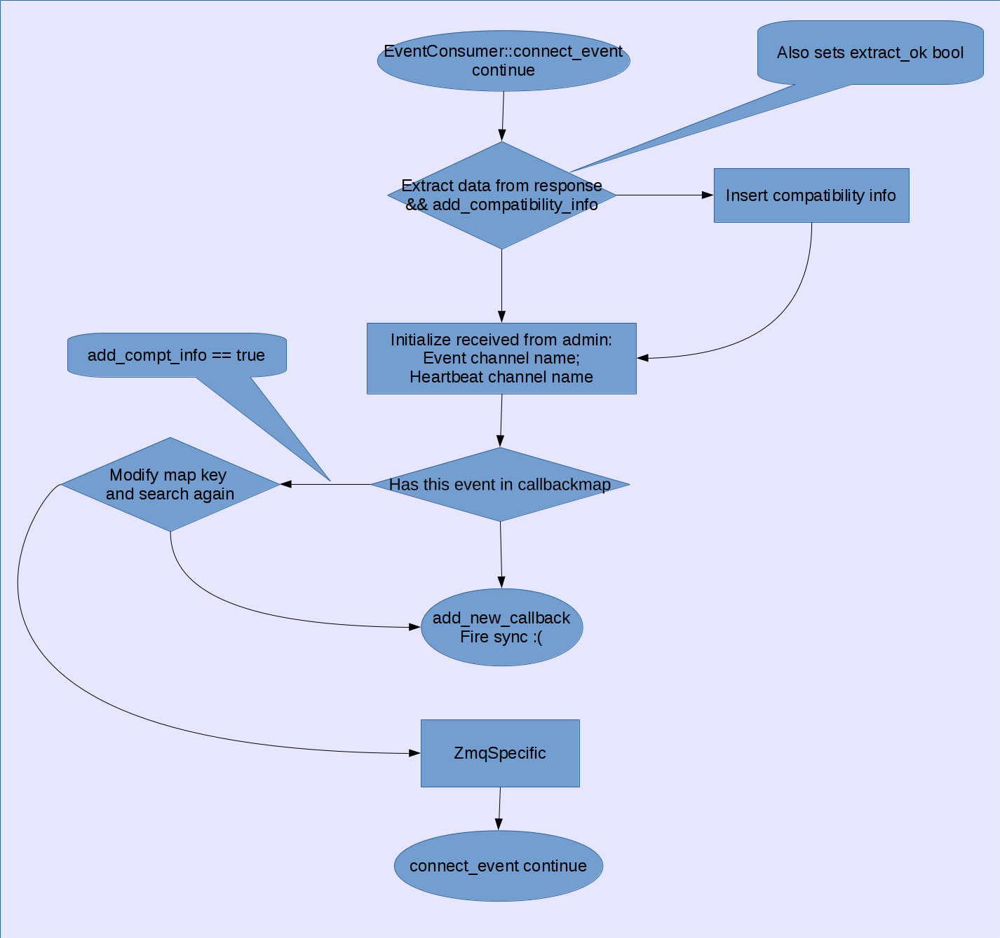
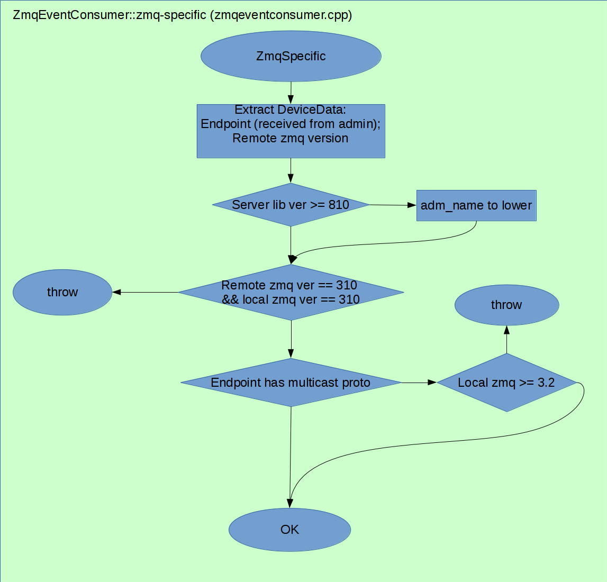
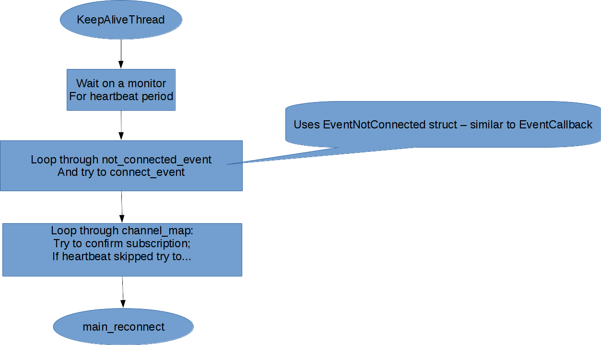

# Event System

In this section an analysis of the existing cide base related to Tango Event System (9.3.x). Exisiting code base is presented in blockscheme diagrams. These blockscheme diagrams are close to actual code i.e. only a very few very low level detailes are omitted.

## Event System classes

## Event subscription

### AttrProxy::subscribe_event

### EventConsumer::subscribe_event

### EventConsumer::connect_event

### ZmqEventConsumer::zmq_specific

### ZmqEventConsumer::connect_event_channel

### ZmqEventConsumer::connect_event_system

 

## Event reconnect

Reconnection happens in KeepAliveThread after receiving a heartbeat event.

## Conclusions

Currently event subscription algorithm on the client side is strictly procedural. Basically all the code is located in EventConsumer::connect_event method.

There are several severe problems with the existing code base:
 
 1) does not follow OOP principles. Event worse existing class structure makes it up side down - Channel and Callback structures inherit from more specific Zmq and Base (Notifd???) structures
 2) logic hard to read and maintain due to a lot of similar but quite different code; a lot of nested if/else statements; a lot of if-without-else statements etc
 3) code duplications - full event name is built several times
 4) there is no clear API for event subscription algorithm, basically there is only one method EventConsumer::connect_event which is impossible to unit test
 5) there is no clear bouundaries between low level and high level logic e.g. raw response from the admin server passed through all over the code base

A PR has been created to address these issues and to propose refactoring: [link](https://github.com/tango-controls/cppTango/pull/470) 