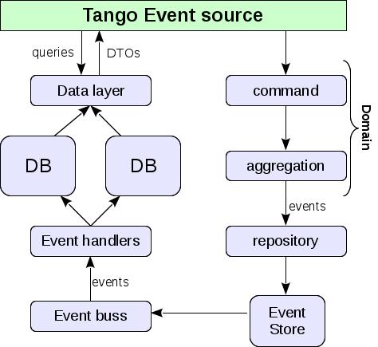

# Events in Tango.  

Change is the only constant factor nowadays. And we need to embrace change. 
Agile methods, agile modeling, agile practices… That is all about change. 

Change = Modification. 

In this document we have decided to use quality attributes (see "_Quality attributes_" section) to look at our view of the possibility of Tango core to change.

Here we won’t talk about events implemented in Tango Controls but rather about a common term. As we can see events are natural for Tango system, e.g. motor position change, vacuum loss, temperature changes etc. These are all events that Tango Controls must embrace and process naturally with minimal developer/administration efforts. Currently, there is a possibility to produce events (even though a considerable amount of efforts are required to setup and maintain it), but there are almost no build-in procedures to process them – client defines their own callbacks etc. Tango must provide a more centralized and organized way of processing events including logging, filtering etc.

A common pattern that is widely used in Computer Science for similar needs is _CQRS + Event sourcing_. In other words we suppose that one of our goals is to design Tango core in such a way that CQRS is applied to Event sourcing.

A pattern or architecture concept _CQRS_ – Command-Query-Responsibility-Segregation – is a form of an imperative computer programming principle where Command and Query are separate objects to retrieve and modify data. Asking a question should not change the answer – append only log.

The domain is the write side and contains all the behavior. The read side is specialized for reporting needs. 

Command/Event Bus delegates each command/event to the command/event handler. Command Handlers have connection to the repository and execute the appropriate domain behavior.
Having this division will help us with performance, tuning and independent software development.
For better understanding, please, refer to the ["What is CQRS" article](https://www.codeproject.com/Articles/555855/Introduction-to-CQRS).

_ Lorenzo: not sure I understand this point about CQRS. I mean, CQRS seems to be already in place in TANGO, with the separation between Commands and Attributes. _

Why use _Event Sourcing_ (meaning rebuilding of objects based on events)?

We don’t store object’s state but instead – events sequence.

Martin Fowler: "Event Sourcing ensures that all changes to application state are stored as a sequence of events." (Rather then the state itself).
Using that sequence we can easily restore any state of the object, applying stored events to its initial state.
The complex task now is to define which events we want Tango Controls to store and integrate this mechanism into core (HDB++ may solve partly this task already).

In this case our goal is to integrate event sourcing into Tango core form Tango Kernel + add more events (meta data like DataBase is online, device X is online etc) and design and implement common mechanism to process these events without distinguishing between internal events e.g. attribute read/write and external events  e.g. motor position update, i.e. integrate CQRS in Tango core.

This pattern is not a silver bullet and can be implemented in Tango to solve just a part of the issues like introducing internal event bus and custom event handlers, that can be implemented as plugins rather than standalone Tango servers if CQRS pattern is implemented in Tango core.

_ Lorenzo: _Event Sourcing_ is worth some discussion. It is an interesting technique, but I'm not sure it is really relevant to TANGO, e.g. to a control system in general. Most of the time TANGO devices have to deal with real hardware, which means that the current state is to be determined by the actual values (readings). Moreover, if we think about settings, e.g. attribute writings, in principle these are not part of the state. So, I'm a bit confused as if attribute read/write gets included into the Event sourcing pattern it seems to me that it is contradicting the CQRS pattern... _