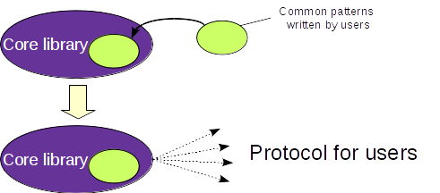

[TOC]

# Authors

Initially this document was created by software developers Igor Khokhriakov ([Ingvord](https://github.com/Ingvord) in GitHub) and Olga Merkulova ([HelgaMond](https://github.com/HelgaMond) in GitHub) who were inspired by Tango Controls Collaboration. 

The full list of authors of this document can be found on this document's GitHub repository [Contributors page](https://github.com/tango-controls/tango-v10-design-doc/graphs/contributors).

# Preface

Writing this document appeared to be quite a challenging thing for us. This was not because we didn't know how to deal with the code. The main challenge was to express our ideas in the right way and to clearly understand how to merge our views with the views of Tango Controls needs and demands (to understand them correctly).

We started to investigate the code from the point of quality attributes. The idea was to analyze the existing Tango Controls core library, gather all the existing features there and then write a sketch of a new architecture having all these existing features. This new architecture was planned to improve maintainability, reliability, adaptability, etc. Afterwards, we wanted to discuss the new architecture with Tango Controls developers, make improvements and build a plan of how to implement the improved architecture having the what we have now.

We spent 7 full days in discussions about which of quality attributes are the most important to reach the business goals and which of them we have already had and which we have to improve. We also wrote a plan of what to do next. But then we decided to ask kernel developers to fill the form with quality attributes and give their view of the percentage of each of the quality attribute regarding the existing kernel code. We had an idea to get the extremum values of quality attributes so that not to miss the existing while refactoring and to improve those are missing.

And here we met the problems. 

1) We had different views of what to call “kernel”, what to call “core”.

2) Our idea of writing a new architecture first and then thinking about further steps was not accepted.

So we had to review our work on this document.

First, we included terminology and definitions part and gave our view of what we call “Kernel”, “Core”, etc.
Second, we gave up the idea of writing a sketch of a new architecture of core library. 

We ended up with the following.

1) Take a part from the existing core code;

2) Make a block scheme/sketch of it;

3) Write a new block scheme which aims to simplify the existing core code and increase the value of quality attributes;

4) Present “skeletal” implementation sketches based on Java interfaces.

This should give us the next benefits:

- We will have a documentation for the existing core code.

- It is easier to review small parts.

- This should make further discussions shorter and more productive.

- You can start refactoring without “waiting” other parts to be reviewed.

We also have in plan to extend the existing protocol. The following flowchart shows the idea of the changes which will be presented in more details in this document.

* Lorenzo: the figure, as proposed, is unclear; either requires some more explanation or better to be moved into a more detailed context. Moreover, it would be useful to have figure numbers and captions, for an easy and effective reference (would the rst figure directive work here?) *

## Introduction

In this part you will find what to expect from this document and in which way information and ideas are presented.

First of all, please, read _Terminology and definitions_ part to find out what we mean by "core library" as everything we are going to talk about further is going to be about "core library".

We have decided to look at the Tango Controls form the perspective of quality attributes. The most important and those we think are lacking are in the Quality attributes part. Of course, we were keeping in mind other quality attributes while working on this document.

_Client_ and _Sever_ parts have logical diagrams of the parts of the existing code (event system, event subscription, event reconnect and polling). These diagrams don't show how the implementation was done but give a nice overview of what is happening. In these part you can also find refactoring proposals and links to corresponding pull requests in GitHub.

_Tango v10_ part contains design proposals in Java interfaces. The idea to do that in interfaces was not spontaneous. If we begin to talk about Tango Controls concepts, missions and idea – they are all very important and up-to-date and really worth following. There is nothing to add more. But as soon as we look inside – code base and implementations – this is where the major work should be done.

Block schemes and diagrams are used to present information.

We hope that the taken parts of the existing core library will make further discussions and analysis easier. 

## Mission of this document

The ultimate goal of this document is to define a common language between developers with different backgrounds (Physics VS Software development). 
Therefore, improve future communication between them. This will dramatically improve code quality, resolve many current issues and also significantly simplify further bug fixing.

While this document describes the targeted architecture design for Tango core, we keep in mind current community needs and possible difficulties that may occur if migration to this new architecture will be approved.

This document is supplied with flowcharts and "skeletal" implementation sketches based on Java interfaces. These are intended to demonstrate how the new design may be implemented in Tango core library as well it may help to define a roadmap for Tango kernel refactoring. And in the future it is supposed to provide the basis for evolutionary refactoring of Tango Controls.

The goal is to decrease time to market and lower integration and maintain costs of the Tango Controls users.

Finally, it will greatly improve flexibility by reducing design and system complexity.

The initial phase of the creation of this document was funded by Tango Controls Collaboration in 2018 (funding reference is PO712608/WP3).

This document is to be reviewed by Tango Controls Kernel developers/community members on Feb'4th 2019 during [Tango Kernel meeting](http://www.tango-controls.org/community/events/tango-kernel-meeting-doc-camp/). This will be the first time this document is presented to Tango Controls Kernel community members. As the result of the review a Tango V10 development roadmap must be shaped. 

## Business goal

Make Tango Controls suitable for applying in Industry and in Commerce and make it de facto a standard framework for Industry 4.0. Guarantee sustainable existence for the next 15-20 years.

##  Stakeholders

The main idea of this document addresses the concerns of kernel developers. Developers require well defined architectural structures and their relationships. Though, we hope that it facilitates communication among other stakeholders (e.g. end users, project manages, maintainers).
