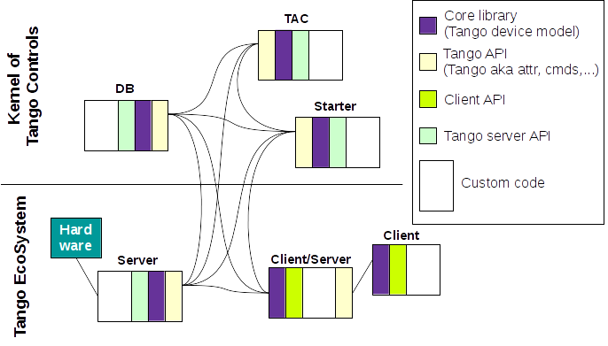

https://www.tutorialspoint.com/software_architecture_design/index.htm

# Introduction

Writing this document appeared to be quite a challenging thing for us. This was not because we didn't know how to deal with the code. The main problem was that we started to express our ideas in the wrong way and didn't clearly understand how to merge our views with the views of Tango Controls needs and demands (perhaps, we also didn't understand them correctly).

We started to investigate the code from the point of quality attributes. The idea was to analyze the existing Tango Controls core library, gather all the existing features there and then write a sketch of a new architecture having all these existing features. This new architecture was planned to improve maintainability, reliability, adaptability, etc. Afterwards, we wanted to discuss the new architecture with Tango Controls developers, make improvements and build a plan of how to implement the improved architecture having the what we have now.

We spent about 7 days in discussions about which of quality attributes are the most important to reach the business goals and which of them we have already had and which we have to improve. We also wrote a plan of what to do next. But then we decided to ask kernel developers to fill the form with quality attributes and give their view of the percentage of each of the quality attribute regarding the existing kernel code. We had an idea to get the extremum values of quality attributes so that not to miss the existing while refactoring and to improve those are missing.

And here we met the problems. 

1) We had different views of what to call “kernel”, what to call “core”.

2) Our idea of writing a new architecture first and then thinking about further steps was not accepted.

So we had to review our work on this document.

First, we included terminology and definitions part and gave our view of what we call “Kernel”, “Core”, etc.
Second, we gave up the idea of writing a sketch of a new architecture of core library. 

We ended up with the following.

1) Take a part from the existing core code;

2) Make a block scheme/sketch of it;

3) Write a new block scheme which aims to simplify the existing core code and increase the value of quality attributes;

4) Present “skeletal” implementation sketches based on Java interfaces.

This should give us the next benefits:
- We will have a documentation for the existing core code.

- It is easier to review small parts.

- This should make further discussions shorter and more productive.

- You can start refactoring without “waiting” other parts to be reviewed.

We also have in plan to extend the existing protocol. The following flowchart shows the idea of the changes which will be presented in more details later in this document.

## Preface

In this part you will find what to expect from this document and in which way information and ideas will be presented.

First of all, please, read _Terminology and definitions_ part to find out what we mean by "core library" as everything we are going to talk about further is going to be about "core library".

We have decided to look at the Tango Controls form the perspective of quality attributes. The most important and those we think are lacking are in the Quality attributes part. Of course, we were keeping in mind other quality attributes while working on this document.

We have taken some parts of the existing core library to make analysis and further discussions easier. 

Block schemes and diagrams are used to present information.

## Mission of this document

The ultimate goal of this document is to define a common language between developers with different backgrounds (Physics VS Software development). 
Therefore, improve future communication between them. This will dramatically improve code quality, resolve many current issues and also significantly simplify further bug fixing.

While this document describes the targeted architecture design for Tango core, we keep in mind current community needs and possible difficulties that may occur if migration to this new architecture will be approved.

This document is supplied with flowcharts and "skeletal" implementation sketches based on Java interfaces. These are intended to demonstrate how the new design may be implemented in Tango core library as well it will help to define a roadmap for Tango kernel refactoring. And in the future it is supposed to provide the basis for evolutionary refactoring of Tango Controls.

The goal is to decrease time to market and lower integration and maintain costs of the Tango Controls users.

Finally, it will greatly improve flexibility by reducing design and system complexity.

### Business goal

Make Tango Controls suitable for applying in Industry and in Commerce and make it de facto a standard framework for Industry 4.0. Guarantee sustainable existence for the next 15-20 years.

###  Stakeholders

The main idea of this document addresses the concerns of kernel developers. Developers require well defined architectural structures and their relationships. Though, we hope that it facilitates communication among other stakeholders (e.g. end users, project manages, maintainers).

# Terminology and definitions

To make our further discussions productive, we would like to define the key words from our point of view and show how we understand them. 

If we look through the concepts of Tango we will probably draw the following scheme (taken from Project Tango-Python at LIONS, iramis - CEA):

And this is a high overview sketch of how we think the Tango elements connect with each other.

The same information presented in another way:

Each block is opened up as following:

So talking about improvements and refactoring in this document we consider _only_ what is marked as "Core library".

# Quality attributes

Many factors determine the qualities in a system's architecture.
The next figure shows the [ISO/IEC FCD 25010](http://iso25000.com/index.php/en/iso-25000-standards/iso-25010) product quality standard. This quality model determines which quality characteristics should be taken into account when evaluating the properties of a software product.

Currently Tango core faces the following problems that prevent it from reaching its business goals:

1) Human resources which are allocated to development and improvement of the Tango core code are very limited

2) Current code base structure does not meet quality level of commercial/open source projects of a similar size

3) Dependency on a legacy CORBA framework and most importantly Tango is a thin wrapper onto of CORBA

4) Parts of the Tango code violate principle of information hiding and separation of concerns

5) Dependency on specific versions of 3rd party libraries (CORBA, ZMQ) in a way that changing the version or a library almost impossible

6) Unclear ways of the interaction between components of the system

To solve the above problems we suggest to focus on the following quality attributes and redesign Tango core library.

Some of the quality attributes from the above picture are naturally inherited from CORBA design i.e. Interoperability.

Below is a short analysis of the presence of particular attributes in Tango:

**TODO** define and describe presence of all other quality attributes in Tango (inherited from CORBA)

The most important and those which Tango Controls mostly miss are the following.

НАПИСАТЬ, ПРО КОРБУ. НАДО ПОНЯТЬ ИЗБАВЛЯТЬСЯ ОТ НЕЁ ИЛИ НЕТ. ЕСЛИ ДА, ТО КАКИЕ ПОСЛЕДСТВИЯ, ЕСЛИ НЕТ, ТО КАК МОЖНО ИЗМЕНИТЬ КОД ДЛЯ ЭТОГО.

_Maintainability_

Tango is a long term project therefore code readability and its modifiability must prevail over non-trivial code optimizations. Due to the fast progress in the IT nowadays optimizations may decrease performance tomorrow i.e. consider new CPU commands and built-in compiler optimizations.

- Modifiability (the most important)
- Modularity (guarantees Modifiability)
- Testability (as the result of Modularity)

_Reliability_

Tango is a framework used in critical environments (non stop operations, minimal downtime etc) therefore Tango kernel must foreseen errors, faults etc

- Fault tolerance (the system should recover itself)
- Recoverability (...)

_Performance_

We must also test what developers of device servers write.

- Resource utilization (the library itself should not take much)

_Extensibility_ (like possibility to use maven. Use plugin-like model of development) 

- Tango Controls must provide an easy way to extend itself to users aka plugins

The following must be considerate during design but not the goal per se.

_Portability_

- Installability (there must be packaging)
- Adaptability (like device catalogue)

_Functional suitability_

### Maintainability in Tango

Most important quality attribute within Maintainability group is _Modifiability_. 

Currently it is relatively easy to add new functionality i.e. extendability. For instance, to add a new command to a database server:

1) update IDL

2) implement some glue code on client/server side:

- on the client side: this usually means adding a new method to DeviceProxy

- on the server: implement command and glue it to TangoDatabse device server API

But it is very hard to change existing functionality i.e. patches, changes to protocol (send new data as command response). Or to expand core functionality e.g. integration with dbus.

Impossible to change underlying protocol - currently is bound to CORBA

**Conclusions**

Either historically or intentionally architecture was adapted for adding new functionality. Nowadays when functionality is mature enough (it is hard to foreseen any major additions like event system or new polling mechanism) focus must be switched to changes to the existing code base or allow quick fixes, performance improvements and most importantly pluggability, so users can implement their own changes in a centralized manner without changing core library.

### Reliability in Tango

The most important feature of availability must be fault tolerance as Tango performs in critical environments. Fault tolerance provides several important features that must be foreseen in Tango:

1) self recoverage

2) self monitoring

3) minimal downtime

### Fault tolerance in Tango

Tango inherits some of the properties from CORBA due to implementation as well as introduces new ones. Specifically:

1) transparent reconnection

2) device's state machine

3) propagating errors to the client

4) heartbeats in event system

These features can be extended with:

1) self monitoring - integrate heartbeat into protocol

2) start-up health check

3) implement errors self recovery (some of them)

**Conclusions**

Fault tolerance is already implemented quite well, but can be improved.

### Adaptability in Tango

As Tango aims to be installed in a variety of environments it is essential to highlight _adaptability_ quality attribute.

The most important is to provide extendability implemented in the core library. Below is the short description of the current situation.

### Extendability in Tango

It is impossible to extend current core library with a custom functionality. Tango may be extended via introduction of new Tango device servers, that may enrich Tango functionality (which is sometimes not so efficient nor enough).

**Conclusions**

Extendability of the core library must be designed from scratch.

# Summary
                                                                                                   
TODO написать, как новая архитектура повлияла на атрибуты, которые уже были (есть) в Танго 
(например, все используют корбу, и не думают, что есть какие-то атрубуты в ней по умолчанию)
и какие новые добавились и как это вообще всё взаимодействует.

The main idea of this design document was to reveal drawbacks and benefits of the existing Tango kernel and to give 
a first perspective of how to improve the pitfalls while maintaining the advantages.

We have looked at Tango core code from the different points of view:

- from a set of different quality attributes,

- different architectural views,

- stakeholder for a System and their interests.

And propose some ideas and thoughts of how this or that viewpoint can be applied in Tango. These views were described in chapters and have examples in block schemes and in "interface" presentation to have thigh level overview.

We hope that this design document will help to look at the Tango kernel from another point of view and to change the attitude to development and adding new features.

Business goals and scenarios were not covered in details in this document.

ОБОЗНАЧИТЬ ПУНКТЫ ДЛЯ ОБСУЖДЕНИЯ НА МИТИНГЕ.
Высокоуровневая часть ок. Но если смотреть на детали, то не очень. Смотришь на блок схему, тоже не очень. Но сама реализация, например, со статическими методами зачем-то. 
Часть можно вынести на уровень протокола, но реализованы в ядре(напрмиер, подписывание событий)

