# Server side specific

[TOC]

# Existing codebase

## Polling 

### Polling framework classes

---
### PollingThread main loop

pollthread.cpp

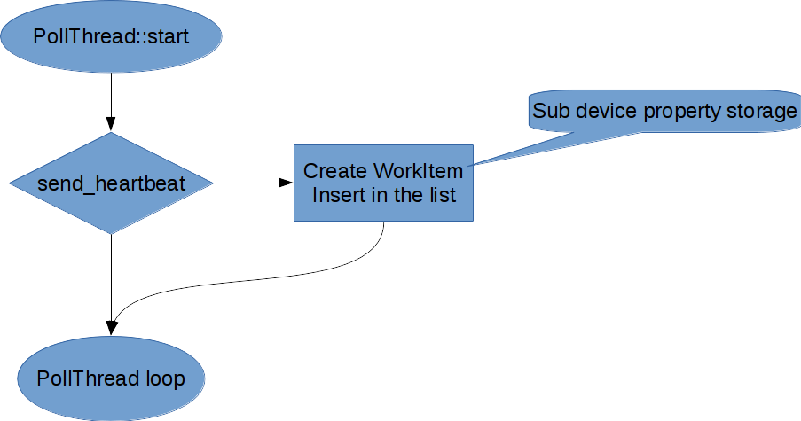

---

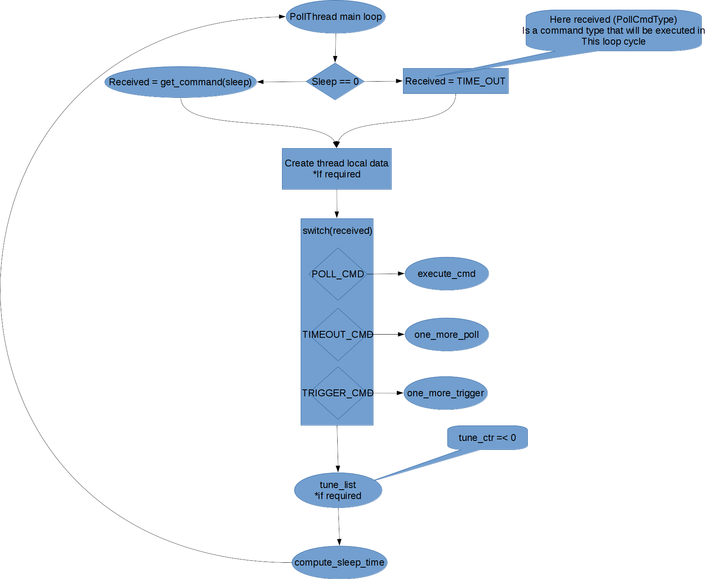

---

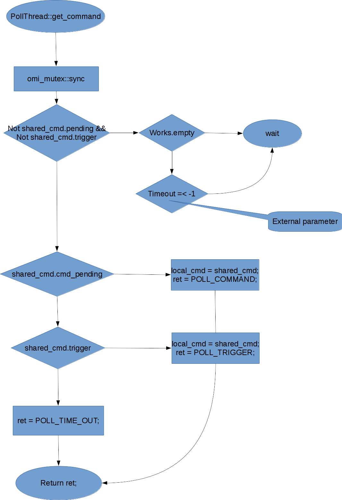

---

#### PollingThread::main_loop::execute_cmd

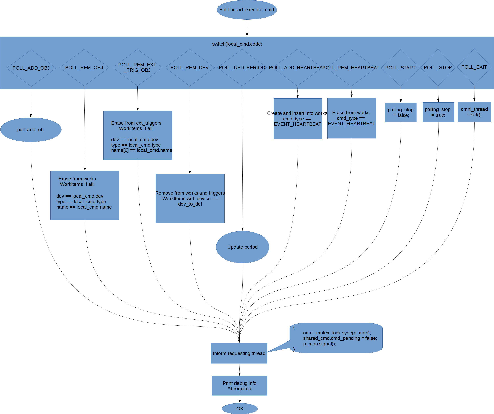

---

##### PollingThread::main_loop::execute_cmd::poll_add_obj

---

##### PollingThread::main_loop::execute_cmd::update_period

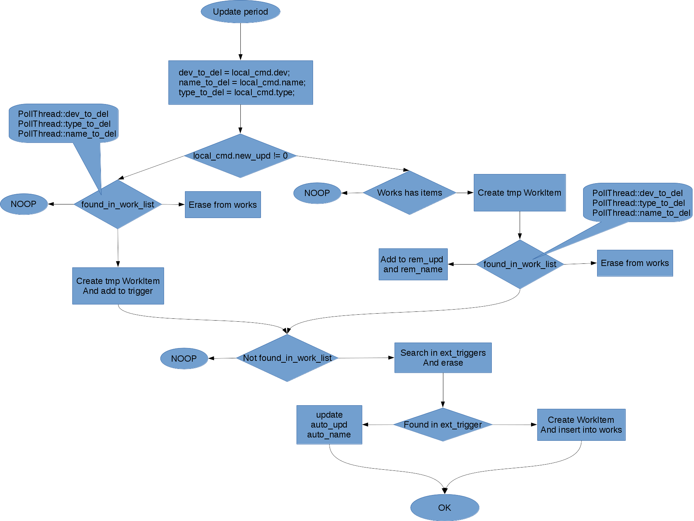

---

#### PollingThread::main_loop::one_more_poll

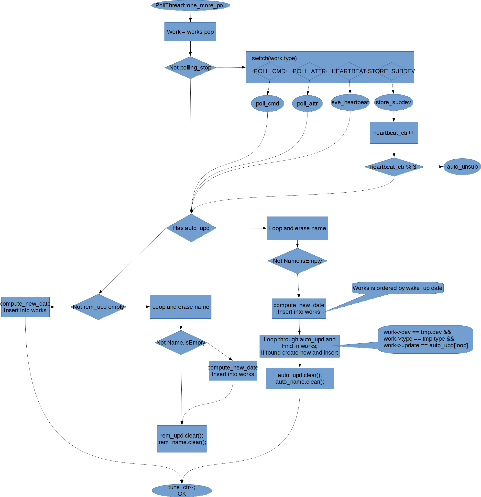

---

#####  PollingThread::main_loop::one_more_poll::poll_cmd

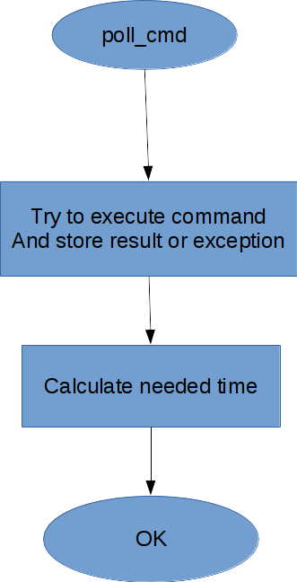

---

#####  PollingThread::main_loop::one_more_poll::poll_attr

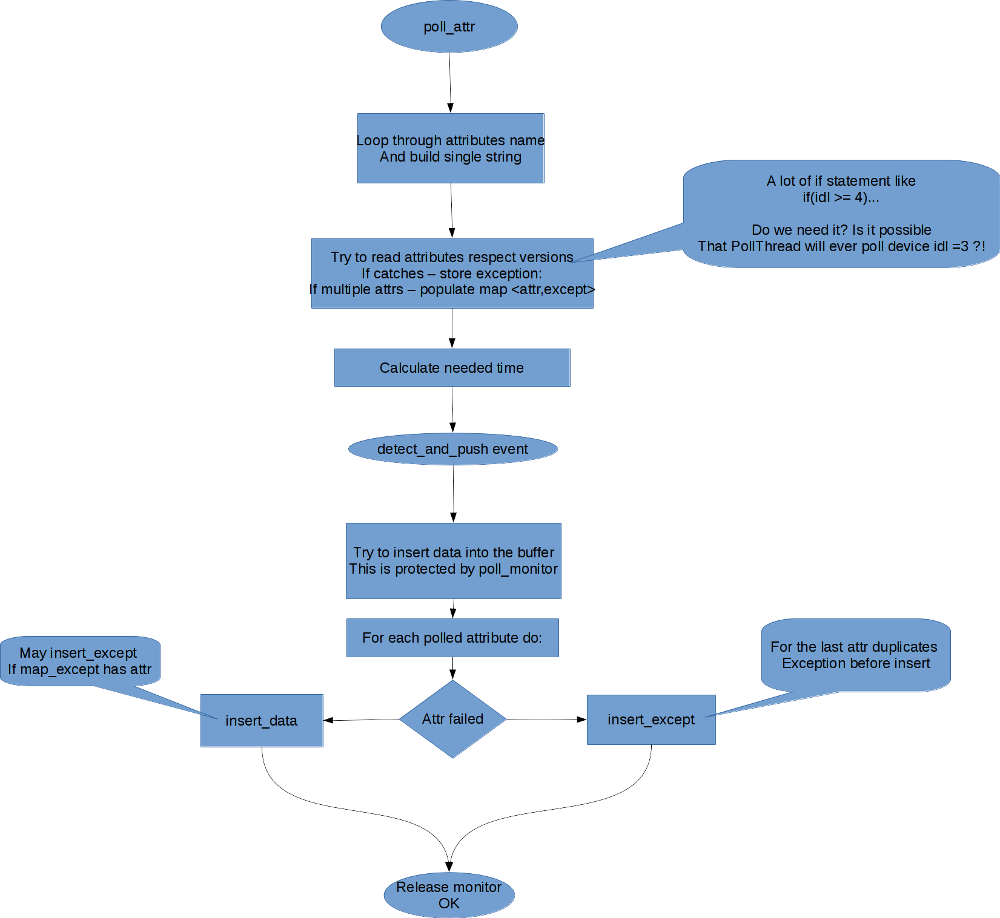

---

#####  PollingThread::main_loop::one_more_poll::eve_heartbeat

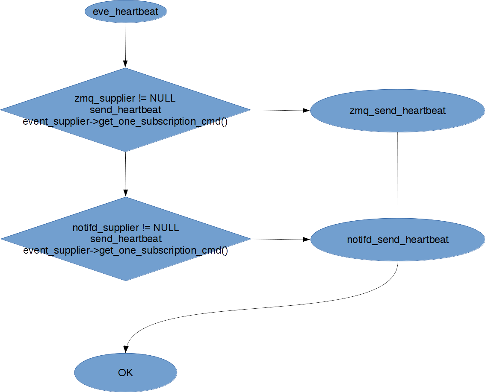

---

#####  PollingThread::main_loop::one_more_poll::store_subdev

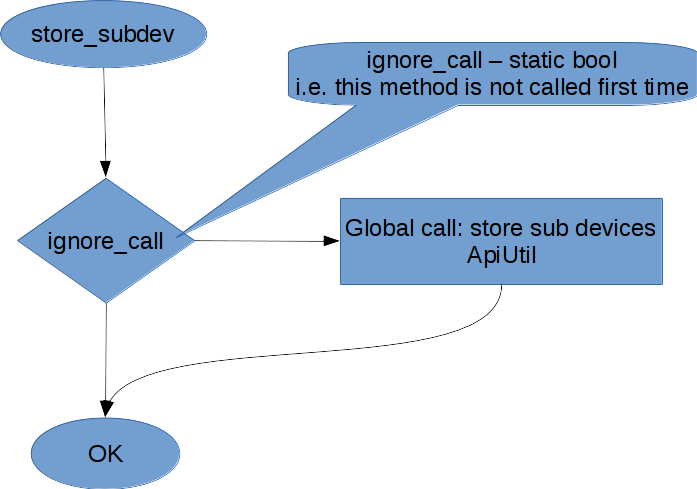

---

#### PollingThread::main_loop::one_more_trig

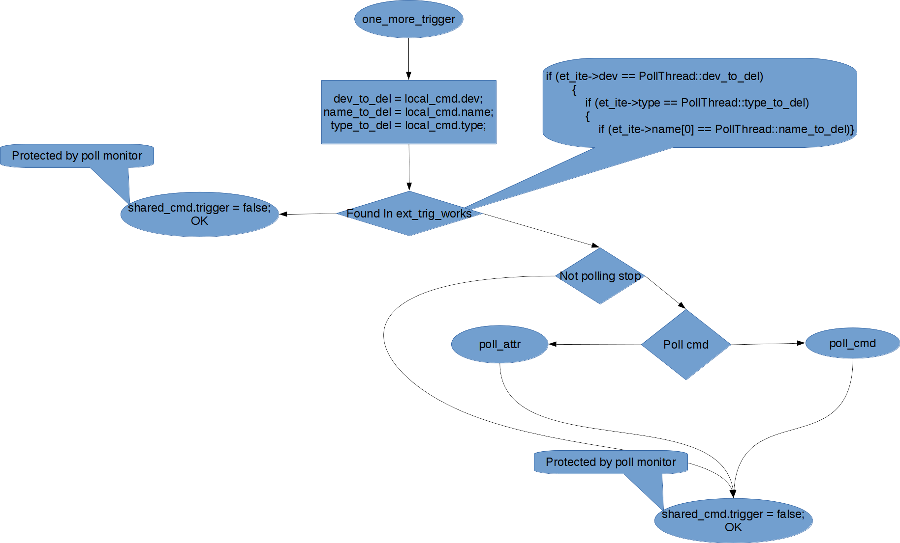 

---

## Polling client: DServer

### DServer::add_poll_obj

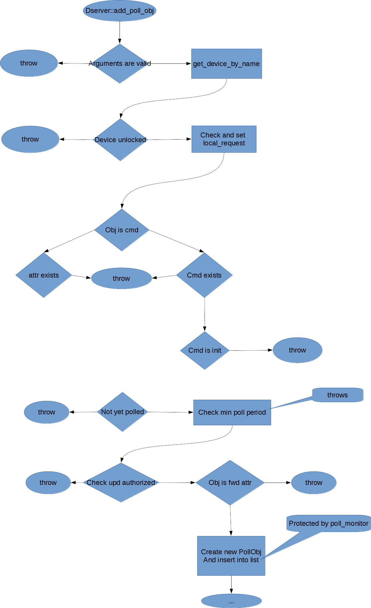

---

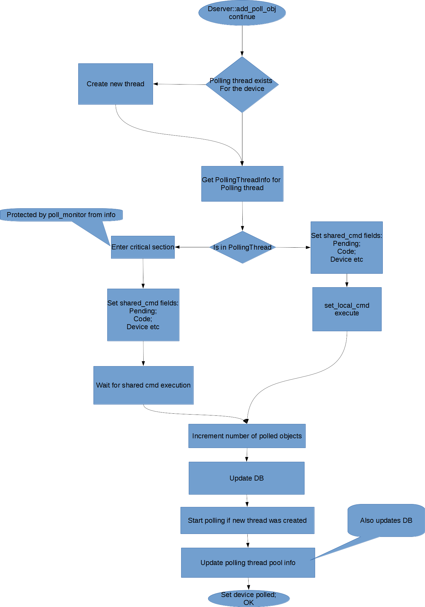

---

## Conclusions

Current code base tries to implement [Command pattern](https://en.wikipedia.org/wiki/Command_pattern) but fails to do so due to the lack of OOP principles implemented (no polymorphism; complicated responsibilities structure, etc).

The following key features may be extracted from the code base:

1) Heartbeat;

2) Thread control via shared command;

3) Attributes/Commands may be polled at different rate;

4) Thread pool;

5) Values are stored in RingBuffer;

6) external trigger (??? need more info/use cases).

## Refactoring proposal

Separate "Control thread" and "Worker threads". Implement standalone queue for execution tasks. "Control thread" will wake up at next execution time and submit the task to "Worker thread" via thread pool interface.

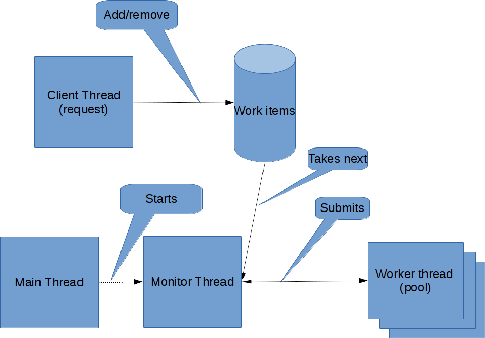

New classes diagram:

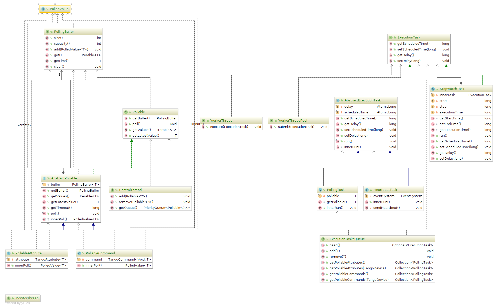

See [Pull Request #472](https://github.com/tango-controls/cppTango/pull/472) for more details.
