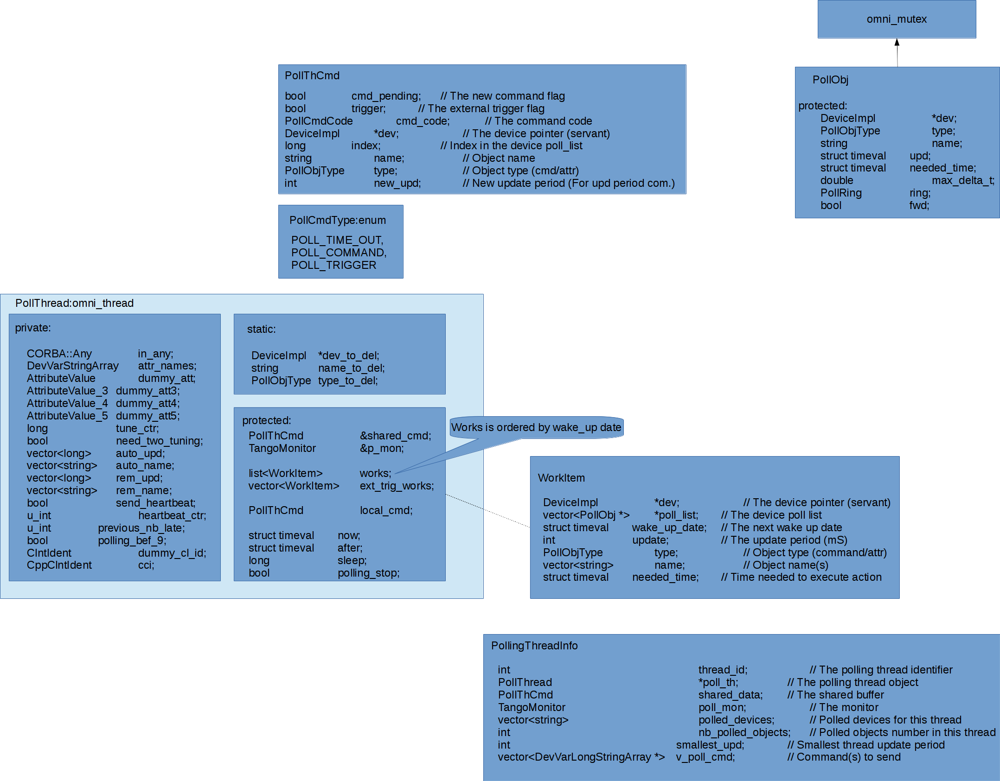
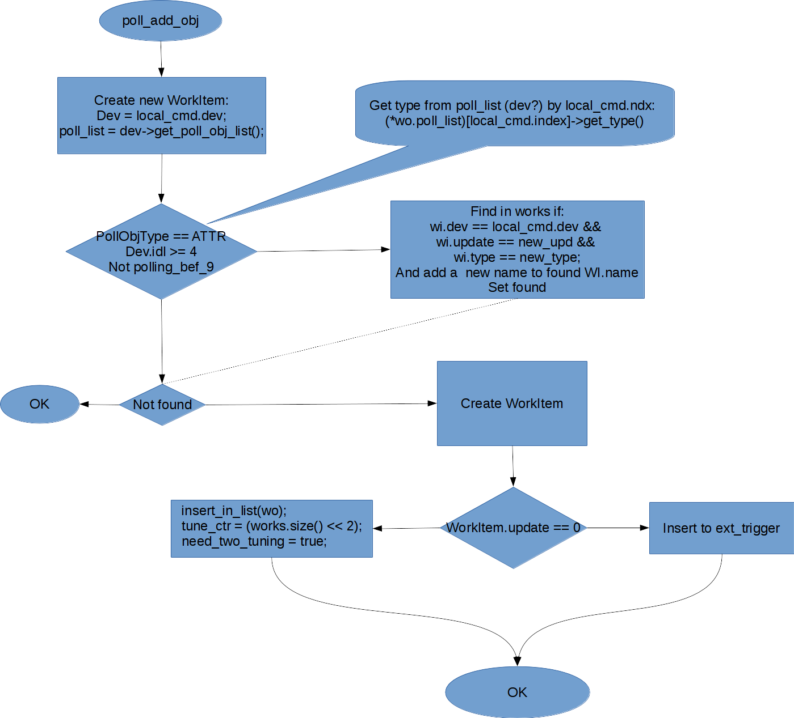

# Server side specific

[TOC]

# Existing codebase

## Polling 

### Polling framework classes



### PollingThread main loop

pollthread.cpp


#### PollingThread::main_loop::execute_cmd


##### PollingThread::main_loop::execute_cmd::poll_add_obj



##### PollingThread::main_loop::execute_cmd::update_period


#### PollingThread::main_loop::one_more_poll


#####  PollingThread::main_loop::one_more_poll::poll_cmd


#####  PollingThread::main_loop::one_more_poll::poll_attr


#####  PollingThread::main_loop::one_more_poll::eve_heartbeat


#####  PollingThread::main_loop::one_more_poll::store_subdev


#### PollingThread::main_loop::one_more_trig

 

## Polling client: DServer

### DServer::add_poll_obj


## Conclusions

Current code base tries to implement [Command pattern](https://en.wikipedia.org/wiki/Command_pattern) but fails to do so. Due to lack of OOP principles implemented (no polymorphism; complicated responsibilities structure etc).

The following key features may be extracted from the code base:

1) Heartbeat

2) Thread control via shared command

3) Attributes/Commands may be polled at different rate 

4) Thread pool

5) Values are stored in RingBuffer

6) external trigger (??? need more info/use cases)  

## Refactoring proposal

Separate "Control thread" and "Worker threads". Implement standalone queue for execution tasks. "Control thread" will wake up at next execution time and submit the task to "Worker thread" via thread pool interface.


New classes diagram:


See [PR#472](https://github.com/tango-controls/cppTango/pull/472) for more details.


# Tango V10 proposed design

Below are some ideas that are proposed by this document to be implemented in server side Tango v10 core library.

## Internal event bus

Server side library is split into loosely coupled components. Each component interacts with others via internal event bus:

```java

interface EventBus {
    void subscribe(String event, Class<T> dataType);
    
    <T> void publish(String event, Message<T> message);//TODO runtime message type check
} 

interface Message<T> {
    String getEventName();
    T getEventData();    
}

interface EventBusListener {
    void onBeforeEvent();
        
    void onEvent(Object message);
    
    void onError(Exception clause);
    
    void onAfterEvent();
}

```

TangoEventBus extends EventBus by adding Tango specific server side events:

```java

interface AttributeRead<T extends TangoDeviceAttribute<V>, V extends TangoDataType> {
    T getAttribute();
    V getData();    
}

interface AttributeWrite<T extends TangoDeviceAttribute, V extends TangoDataType> {
    T getAttribute();
    V getData();    
}

interface CommandExecute<T extends TangoDeviceCommand<IN, OUT>, IN extends TangoDataType, OUT extends TangoDataType> {
    T getCommand();
    IN getInput();    
    OUT getOutput();
}

interface TangoEventBus extends EventBus {
    void attributeRead(Message<AttributeRead> data);
    
    void attributeWrite(Message<AttributeWrite> data);
    
    void commandExecute(Message<CommandExecute> data);
    
    void eventReceived(Message<TangoEvent> data);
}

interface TangoReadAttributeListener {
    void onBeforeAttributeRead(Message<AttributeRead> data);
    
    void onAttributeRead(Message<AttributeRead> data);
    
    void onAfterAttributeRead(Message<AttributeRead> data);
}

interface TangoWriteAttributeListener {
    void onBeforeAttributeWrite(Message<AttributeWrite> data);
    
    void onAttributeWrite(Message<AttributeWrite> data);
    
    void onAfterAttributeWrite(Message<AttributeWrite> data);
}

interface TangoExecuteCommandListener {
    void onBeforeExecuteCommand(Message<CommandExecute> data);
    
    void onExecuteCommand(Message<CommandExecute> data);
    
    void onAfterExecuteCommand(Message<CommandExecute> data);
}

interface TangoEventReceivedListener {
    void onBeforeEventReceived(Message<EventReceived> data);
    
    void onEventReceived(Message<EventReceived> data);
    
    void onAfterEventReceived(Message<EventReceived> data);
}

//etc
```

## TangoKernelComponent

Each component receives TangoContext and DeviceContext during initialization:

```java

interface TangoKernelComponent {
    void initialize(TangoContext tangoContext, DeviceContext context);
}

interface TangoWorkerComponent extends TangoKernelComponent {
    void start();
}

``` 

Typical TangoComponentImpl:

```java

class Foo implements TangoKernelComponent, TangoWriteAttributeListener {//TODO generics
    //in Java this can be replaced with annotation type, i.e. @TangoComponent or @TangoWorkerComponent 
    static {
        TangoContext.registerComponent(Foo.class);
    }

    /**
    * NOTE: in Java this can be replaced with DependencyInjection aka Guice 
    */
    @Override
    void initialize(TangoContext tangoContext, DeviceContext context){
        tangoContext.getEventBus().subscribe("org.tango.read_attribute");
    }
    
    void onBeforeAttributeWrite(AttributeWrite<> message){//TODO generics
        System.out.printf("Write %d into attribute %s ",message.getData(), message.getAttribute().getName());        
    }
}

```

### TangoEngineComponent

Central component of the server side API is TangoEngineComponent. This component intiliazes all other components and performs 
an orchestration of all components i.e. wraps TangoEventBus:

```java

interface TangoEngineComponent extends TangoComponent{
    void start();
}

``` 

Typical implementation:

```java

class TangoEngineComponentImpl implements TangoEngineComponent {
    void initialize(TangoContext context, DeviceContext deviceContext){
        context.getRegisteredComponents()
            .forEach( (cmpt) -> System.out.println(cmpt.getClass().getSimpleName()));
    }
    
    void start(){
        context.getRegisteredWorkerComponents()
            .forEach( (cmpt) -> cmpt.start());        
    }
}

```

### AttributeReadComponent

### AttributeWriteComponent

### EventSystemComponent

### PollingComponent

### LoggingComponent

