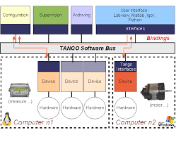
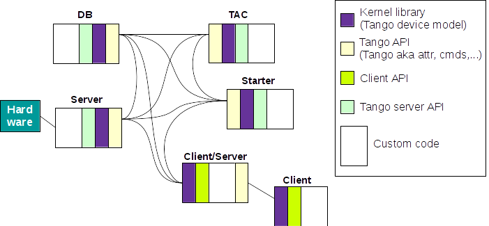
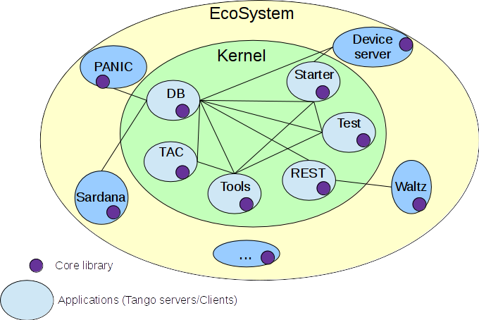
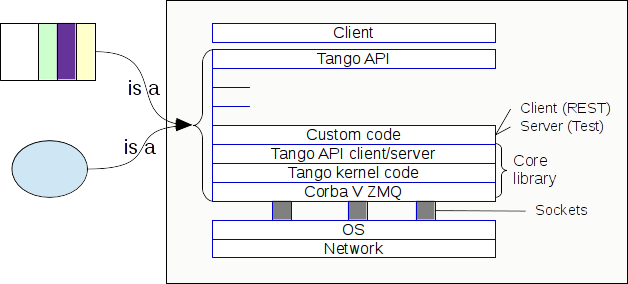

# Terminology and definitions

To make our further discussions productive, we would like to define the key words from our point of view and show how we understand them. 

If we look through the concepts of Tango we will probably draw the following scheme (taken from Project Tango-Python at LIONS, iramis - CEA):

And this is a high overview sketch of how we think the Tango elements connect with each other.

The same information presented in another way:

Each block is opened up as following:

So talking about improvements and refactoring in this document we consider _only_ what is marked as "Core library".